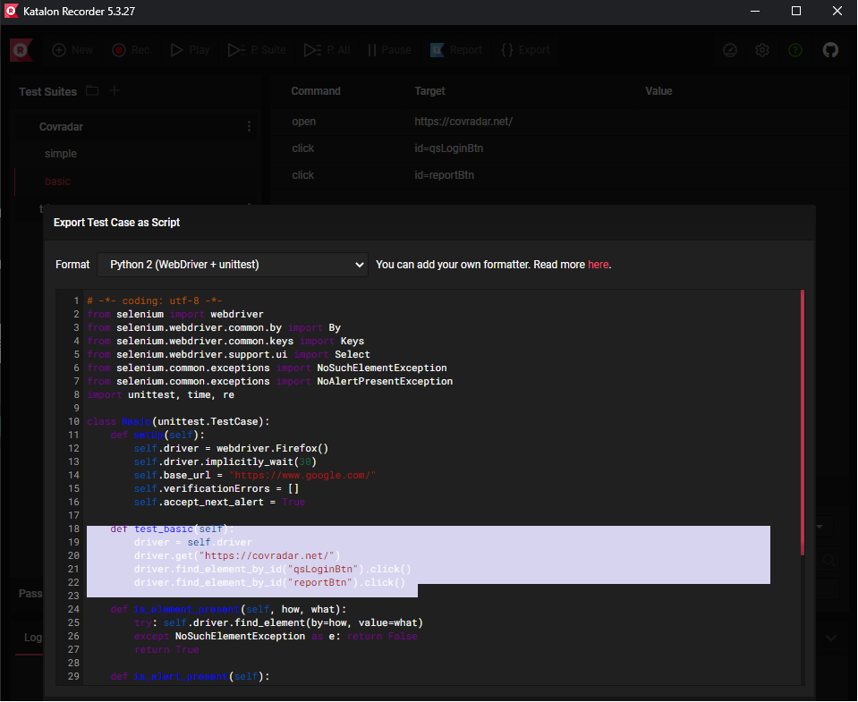

# Webapp-testing: generate and run selenium tests on covradar.net
## How to generate a selenium test for covradar.net:

### 1. install the chrome-extension "katalon recorder" in your chrome browser:

https://chrome.google.com/webstore/detail/katalon-recorder-selenium/ljdobmomdgdljniojadhoplhkpialdid

### 2. press "Record"
### 3. Smash some buttons on covradar.net
### 4. press "Stop"
### 5. Export (as Python)



### 7. copy&paste it in the following blueprint:

```py
from selenium import webdriver
import unittest

class Basic(unittest.TestCase):
    def setUp(self):
        chrome_options = webdriver.ChromeOptions()
        chrome_options.add_argument('--headless')
        chrome_options.add_argument('--no-sandbox')
        chrome_options.add_argument('--disable-dev-shm-usage')
        self.driver = webdriver.Chrome(options=chrome_options)
        self.driver.implicitly_wait(30)
    
    # def test_basic(self):
    #     driver = self.driver
    #     driver.get("https://covradar.net/")
    #     driver.find_element_by_id("qsLoginBtn").click()
    #     driver.find_element_by_id("reportBtn").click() 

    def tearDown(self):
        self.driver.quit()

if __name__ == "__main__":
    unittest.main()
```

## Run selenium tests on covradar.net

### Run a basic test (`test_basic.py` in this repo):
```sh
docker run -it -v $(pwd)/test_basic.py:/_.py joyzoursky/python-chromedriver:3.8-selenium python _.py
```
>.
>----------------------------------------------------------------------
>Ran 1 test in 7.732s
>
>OK

### Run a test that does some plotting (`test_plot_.py` in this repo):
```sh
docker run -it -v $(pwd)/test_plot_.py:/_.py joyzoursky/python-chromedriver:3.8-selenium python _.py
```
>.
>----------------------------------------------------------------------
>Ran 1 test in 10.641s
>
>OK

# **Advanced**: create a selenium-hub (via kubernetes) and run a test on multiple browser instances

<!-- this project does the following:
1. set up a selenium-hub
2. set up N selenium-nodes of either firefox or chrome browser.
3. executes python unittests on covradar.de - via the selenium-nodes. -->

## How to set up a selenium-hub 
this is just a summary of kubernetes' selenium-hub example 
(full documentation: https://github.com/kubernetes/examples/tree/master/staging/selenium)


```sh
git clone https://github.com/kubernetes/examples
```

## STEP 1 - set up the hub:

```sh
kubectl create -f examples/staging/selenium/selenium-hub-deployment.yaml
kubectl create -f examples/staging/selenium/selenium-hub-svc.yaml
```


## STEP 2 - set up chrome browser nodes (e.g. five nodes):
```sh
kubectl create -f examples/staging/selenium/selenium-node-chrome-deployment.yaml
kubectl scale deployment selenium-node-chrome --replicas=5
```

## STEP 3 - execute a test (see `Dockerfile` in this repo) via the selenium-hub:

This pulls the latest image from tzom/webapp_testing (Dockerfile in this repo) and executes the test on the selenium-hub.

```sh
kubectl create -f selenium-test-job.yaml
```

Optionally, build the required image (from the Dockerfile in this repo):

```sh
docker build -t selenium-test .
```

## STEP 4 - check results

```sh
kubectl get pods
```

>```sh
>NAME                                    READY   STATUS      RESTARTS   AGE
>selenium-hub-78d7c76766-zb7gz           1/1     Running     1          115m
>selenium-node-chrome-5c5d5ff8bd-6m57t   1/1     Running     0          7m8s
>selenium-node-chrome-5c5d5ff8bd-72ckt   1/1     Running     0          7m9s
>selenium-node-chrome-5c5d5ff8bd-8kzh4   1/1     Running     0          7m9s
>selenium-node-chrome-5c5d5ff8bd-j76jk   1/1     Running     0          7m8s
>selenium-node-chrome-5c5d5ff8bd-wx2s2   1/1     Running     0          7m8s
>selenium-test-f9w8l                     0/1     Completed   0          2m36s
>```

```sh
kubectl logs selenium-test-f9w8l
``` 

>.
>----------------------------------------------------------------------
>Ran 1 test in 24.163s
>
>OK


## Teardown
```sh
kubectl delete deployment selenium-hub
kubectl delete deployment selenium-node-chrome
kubectl delete job selenium-test
kubectl delete svc selenium-hub
```
